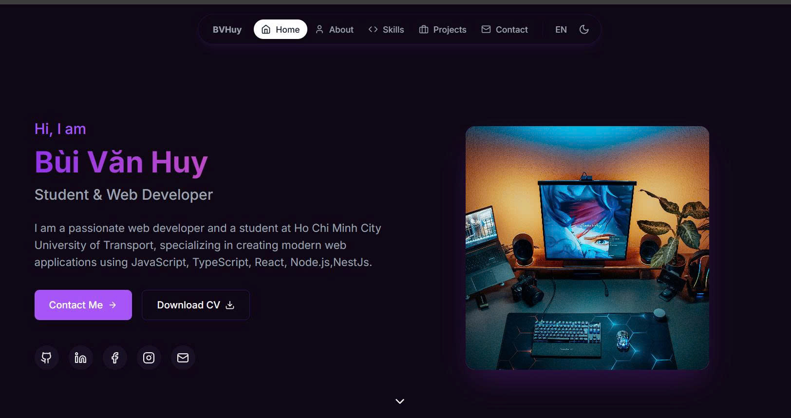

# 🚀 Bùi Văn Huy - Portfolio

Personal portfolio website built with React, TypeScript, and Tailwind CSS.



## ✨ Features

- **Modern Design** - Clean, responsive UI with purple/pink gradient theme
- **Dark/Light Mode** - Toggle between themes with smooth transitions
- **Multi-language** - English & Vietnamese support
- **Animations** - Scroll animations, rotating tech stack, skill bars
- **Terminal-style Skills** - Unique skills display with animated progress bars

## 🛠️ Tech Stack

| Frontend | Styling | Tools |
|----------|---------|-------|
| React 18 | Tailwind CSS | Vite |
| TypeScript | CSS Variables | ESLint |
| React Router | Lucide Icons | Git |

## 🚀 Quick Start

```bash
git clone https://github.com/HuyIT2706/portfolio.git
cd portfolio

npm install

npm run dev

npm run build
```

## 📁 Project Structure

```
src/
├── assets/          # Images, fonts
├── components/      # Header, Footer
├── contexts/        # Theme, Language providers
├── Layout/          # App layout wrapper
├── pages/           # Home, About, Skills, Projects, Contact
├── styles/          # Global CSS
└── locales/         # i18n translations
```

## 🌐 Pages

- **Home** - Hero section, rotating tech stack, featured projects
- **About** - Personal info, education, interests
- **Skills** - Terminal-style skill bars with animations
- **Projects** - Featured projects showcase
- **Contact** - Contact form and social links

## 📱 Responsive

- Mobile-first design
- Breakpoints: `sm` (640px), `md` (768px), `lg` (1024px)

## 📄 License

MIT License - feel free to use for your own portfolio!

---

**Built with ❤️ by Bùi Văn Huy**